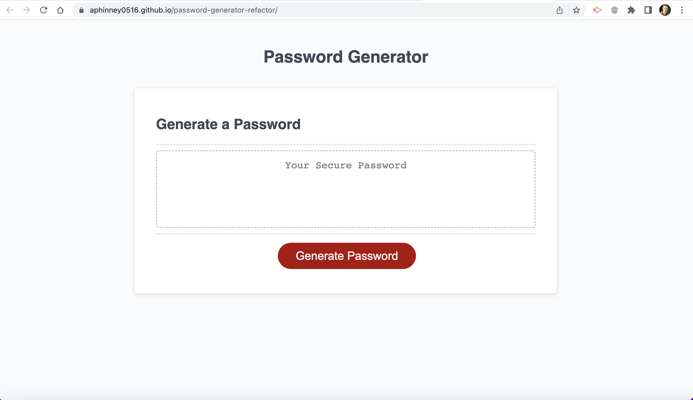
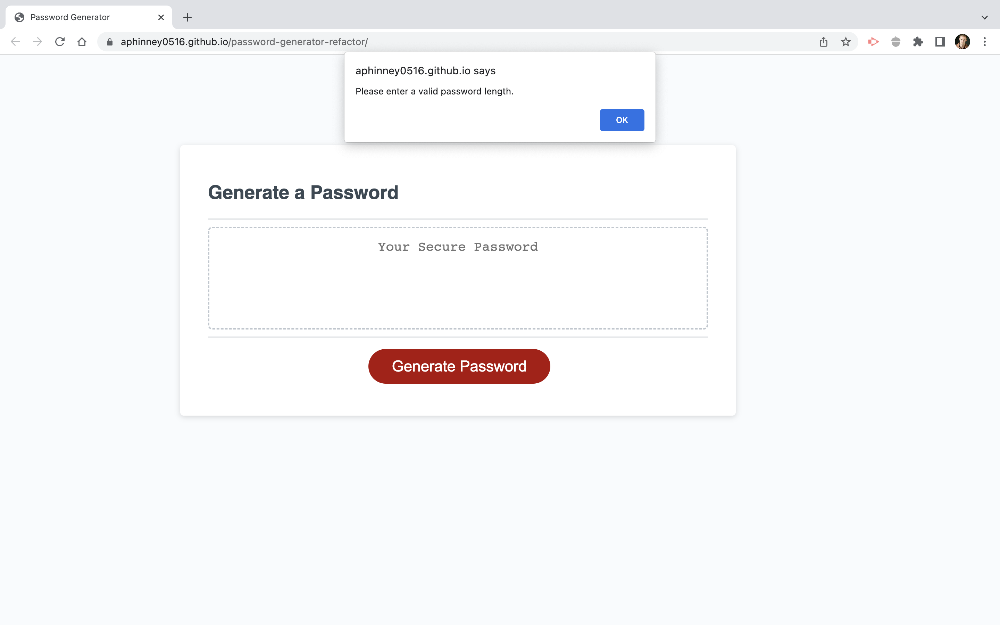
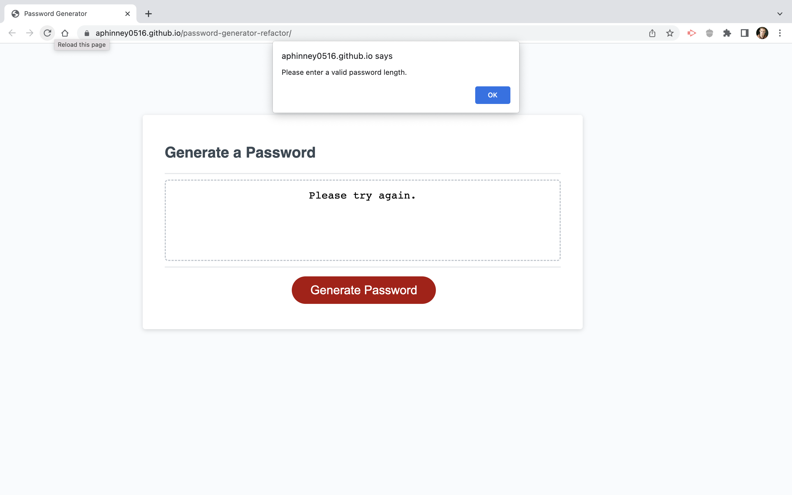
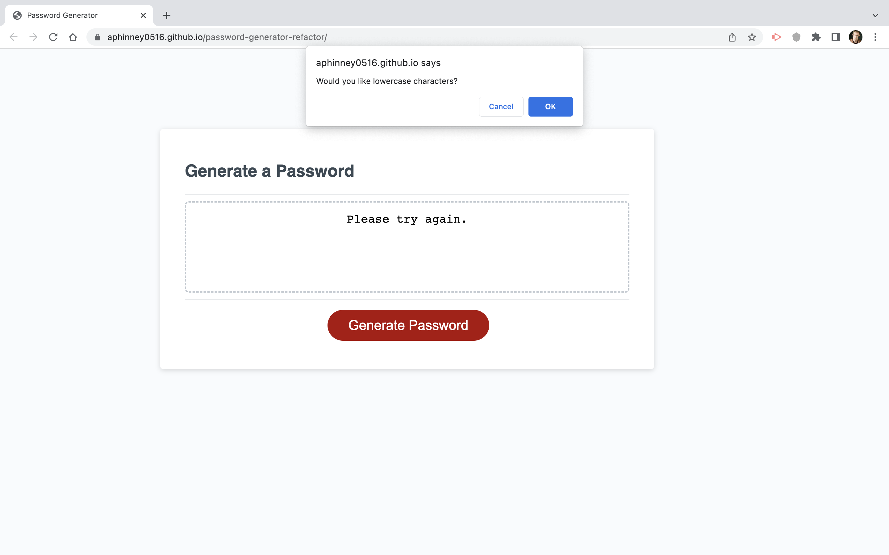
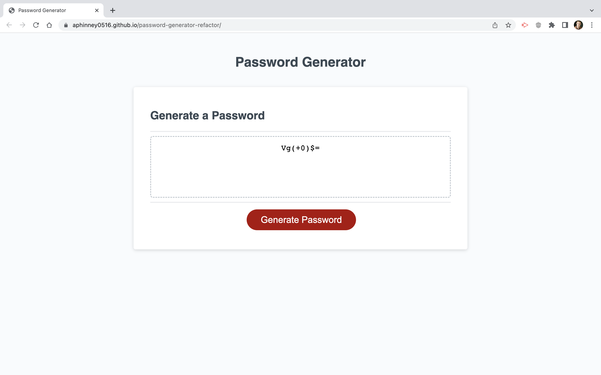

# password-generator-refactor

## Description
I refactored this code in order to provide the user with the ability to generate a random password that consists of upper and lower case letters, numbers, and special characters. The refactored code allows the user to avoid using passwords that are easy for others to guess. Refactoring this code provided me with an good opportunity to better understand the structure of javaScript as understanding it's structre had a lot to do with the debugging of the code.

## Installation
Link to the password generator web document: 
https://aphinney0516.github.io/password-generator-refactor/

Screenshot of the password generator web document:

## Usage
When you click "Generate Password" a window prompt will appear asking you to enter your password length.

You will then enter a number between 8 and 128; otherwise, a new prompt will appear asking you to enter a valid password length, and the message "please try again" will appear in the window above the "Generate Password" button.

A series of 4 prompts will then appear asking if you want to include lowercase letters, uppercase letters, numbers, and special chracters in your password.

After you have responded to each prompt with "yes" or "cancel" a rnadom password will be generated in the window about the "Generate Password" button according to your set criteria.

## Credits
Created by Andrew Phinney with guidance from the Full Stack Coding Bootcamp tutor Corey Yates.

[def]: password-generator-screenshot.png